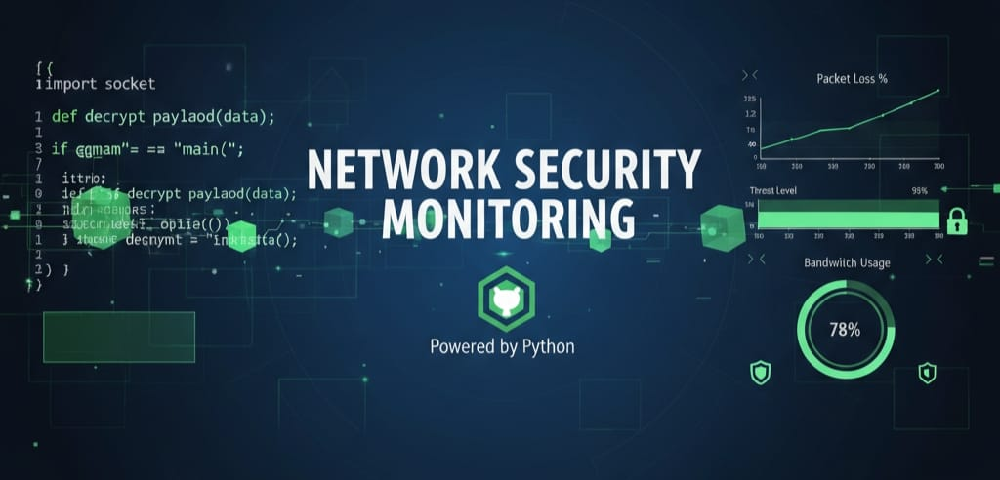

<div align="center">
  
# Network Packet Sniffer with Alert System 🔍🚨

<p align="center">
  
</p>

## A professional real-time network traffic monitoring tool with advanced anomaly detection capabilities, built for cybersecurity analysis and network monitoring.


</div>

## Features ✨

- **Real-time Packet Capture**: Monitor network traffic on any interface
- **Advanced Anomaly Detection**: Detect port scanning, packet flooding, and suspicious activities
- **Multi-channel Alert System**: Real-time alerts via console, logs, and email
- **Data Persistence**: SQLite database for packet logging and analysis
- **Traffic Visualization**: Generate interactive reports and graphs
- **Modular Architecture**: Easy to extend and customize

## Installation 🚀

### Prerequisites
- Python 3.8 or higher
- Administrative/root privileges for packet capture

### Quick Start
```bash
# Clone the repository
git clone https://github.com/devsetpal9-png/Network-Packet-Sniffer-with-Alert-System.git
cd Network-Packet-Sniffer-with-Alert-System

# Install dependencies
pip install -r requirements.txt

# Run with admin privileges
sudo python src/cli_interface.py --help
```

---

## Usage 📖

### Basic Packet Sniffing
```bash
sudo python src/cli_interface.py --interface eth0
```

### Capture Specific Number of Packets
```bash
sudo python src/cli_interface.py --count 100 --interface wlan0
```

### View Recent Packets
```bash
python src/cli_interface.py --show-packets
```

### View Security Alerts
```bash
python src/cli_interface.py --show-alerts
```

### Generate Traffic Report
```bash
python src/cli_interface.py --generate-report
```
---

## Project Structure 🏗️
```
Network-Packet-Sniffer-with-Alert-System/
├── src/                    # Source code
│   ├── packet_sniffer.py   # Core packet capture engine
│   ├── anomaly_detector.py # Anomaly detection algorithms
│   ├── database_manager.py # Database operations
│   ├── alert_system.py     # Alert management
│   └── cli_interface.py    # Command-line interface
├── data/                   # Database files (auto-generated)
├── docs/                   # Documentation
├── tests/                  # Unit tests
├── requirements.txt        # Python dependencies
├── config.py               # Configuration settings
├── report.md               # Project documentation
├── interview_questions              
└── README.md             
```
---

# Data Directory

This directory contains all data files generated by the Network Packet Sniffer.

## Auto-generated Files
- `network_traffic.db` - SQLite database with packet records and alerts
- `network_sniffer.log` - Application log file
- `traffic_report.png` - Generated traffic visualization reports

## Sample Data (for testing)
- `sample_packets.csv` - Example packet data for demonstration
- `sample_alerts.json` - Example alert data for testing

## Git Ignore
Actual data files are excluded from Git via `.gitignore` to prevent committing sensitive network data.

# ⚠️ DISCLAIMER
## Legal Notice
### IMPORTANT: READ THIS DISCLAIMER CAREFULLY BEFORE USING THIS SOFTWARE

#### This Network Packet Sniffer with Alert System ("the Software") is provided for EDUCATIONAL, RESEARCH, AND AUTHORIZED SECURITY TESTING PURPOSES ONLY.

### Legal Compliance
- Unauthorized network monitoring may be ILLEGAL in your jurisdiction

- Always obtain explicit permission before monitoring any network

- Only use on networks you own or have written authorization to monitor

- Comply with local, state, and federal laws regarding network privacy

### Intended Use Cases
- ✅ Educational environments (classrooms, labs)
- ✅ Authorized security testing (penetration testing with permission)
- ✅ Personal network monitoring (your own home/office networks)
- ✅ Research and development (cybersecurity studies)

### Prohibited Uses
- ❌ Unauthorized network surveillance
- ❌ Monitoring networks without explicit permission
- ❌ Corporate espionage or illegal activities
- ❌ Violating privacy laws or terms of service
- ❌ Any malicious or criminal purposes

## User Responsibility
### You are solely responsible for:

- Ensuring proper authorization for network monitoring
- Complying with all applicable laws and regulations
- Using this software ethically and responsibly
- Any consequences resulting from misuse

### No Warranty
This software is provided "AS IS" without any warranties, express or implied. The developers are not liable for any damages, legal issues, or consequences resulting from the use or misuse of this software.

## Ethical Usage Agreement
### By using this software, you agree to:

1. Use it only for legitimate, authorized purposes
2. Respect privacy laws and network policies
3. Assume all responsibility for your actions
4. Not hold the developers liable for misuse

## Security Researchers & Penetration Testers
### If using for security testing:

- Obtain written authorization from network owners
- Follow responsible disclosure practices
- Respect scope and boundaries of authorized testing
- Document all activities for legal protection

